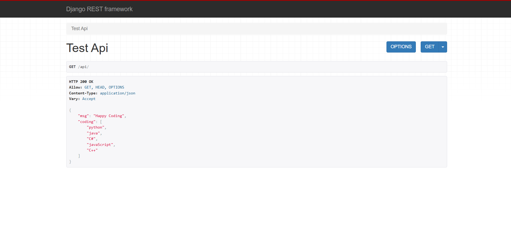
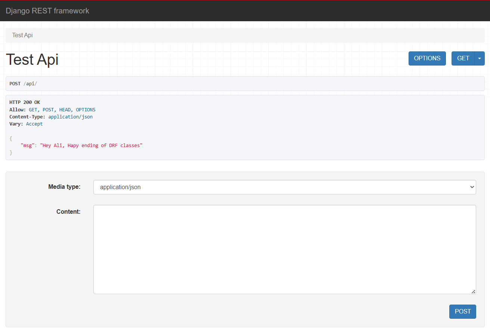
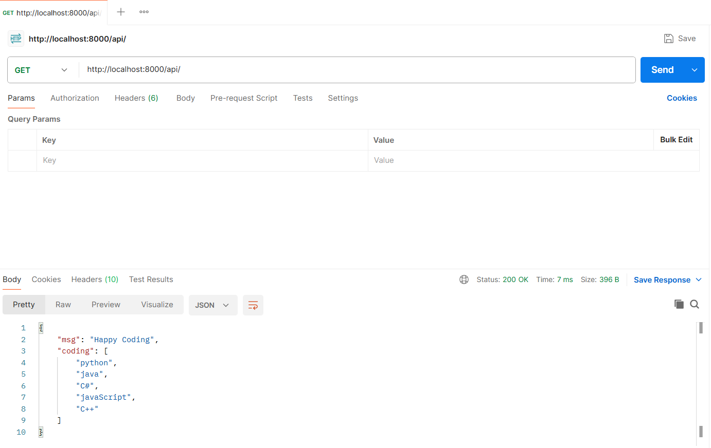
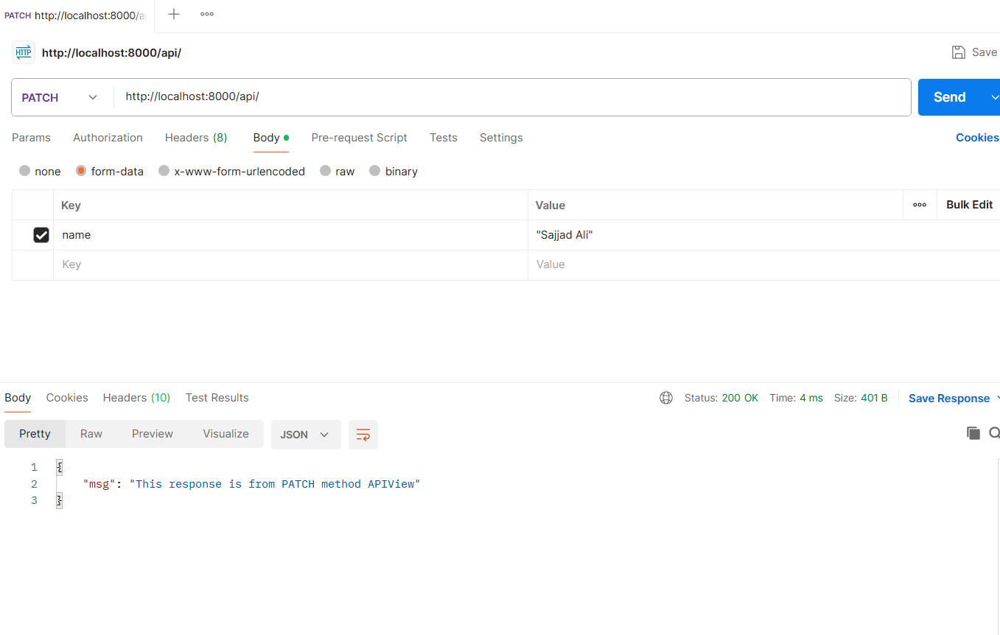
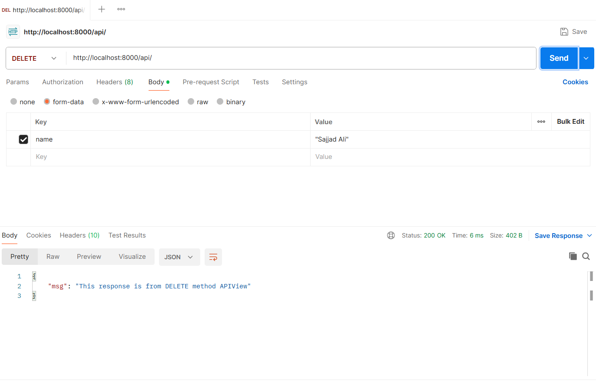
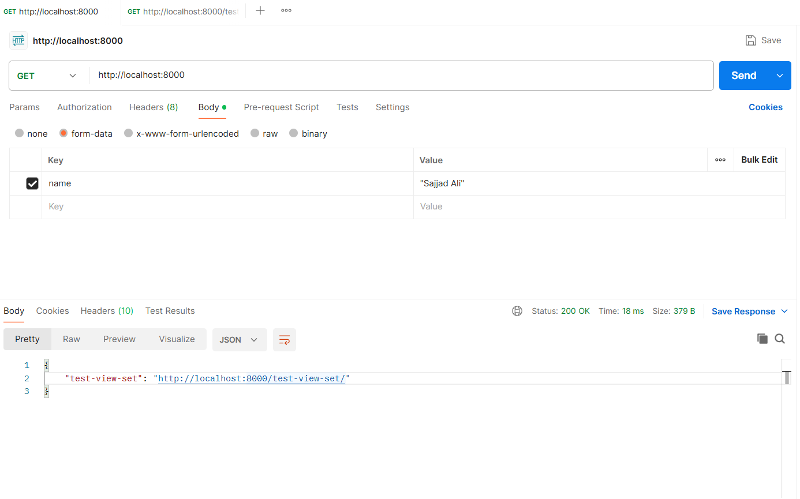
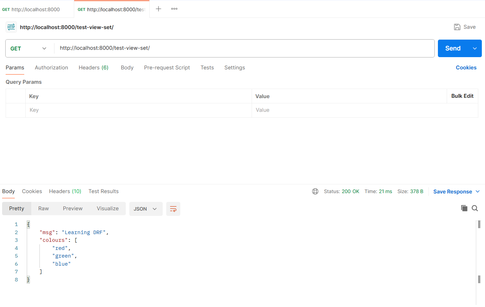

# DRF — APIView & ViewSet Demo

A simple Django REST Framework project demonstrating APIs using `APIView` 
and `ViewSet` with `DefaultRouter`.


---

## API Endpoints

### APIView — `/api/`

| Method | Response |
|---|---|
| GET | Returns list of coding languages |
| POST | Accepts `name`, returns personalized message |
| PUT | Confirms PUT method |
| PATCH | Confirms PATCH method |
| DELETE | Confirms DELETE method |

### ViewSet — `/test-view-set/`

| Action | Method | Response |
|---|---|---|
| list | GET | Returns list of colours |
| retrieve | GET `/pk/` | Fetch single item |
| partial_update | PATCH `/pk/` | Partial update |
| destroy | DELETE `/pk/` | Delete item |

---

## Screenshots

### Browsable API — GET `/api/`


### POST `/api/` — DRF Browsable


### Postman — GET `/api/`


### Postman — POST `/api/`


### Postman — PUT `/api/`


### Postman — PATCH `/api/`


### Postman — DELETE `/api/`


### Postman — GET `/` (Router)


### Postman — GET `/test-view-set/`


---

## Sample Responses

**GET /api/**
```json
{
    "msg": "Happy Coding",
    "coding": ["python", "java", "C#", "javaScript", "C++"]
}
```

**POST /api/**
```json
{
    "msg": "Hey Sajjad Ali, Happy ending of DRF classes"
}
```

**GET /test-view-set/**
```json
{
    "msg": "Learning DRF",
    "colours": ["red", "green", "blue"]
}
```

---

## Setup

```bash
git clone https://github.com/sajjadali-fullstack/drf-apiview-viewset-demo.git
cd drf-apiview-viewset-demo
pip install -r requirements.txt
python manage.py runserver
```

---

## Author

**Sajjad Ali** — [GitHub](https://github.com/sajjadali-fullstack) · 
[Portfolio](https://sajjadali-fullstack-portfolio.netlify.app/)
